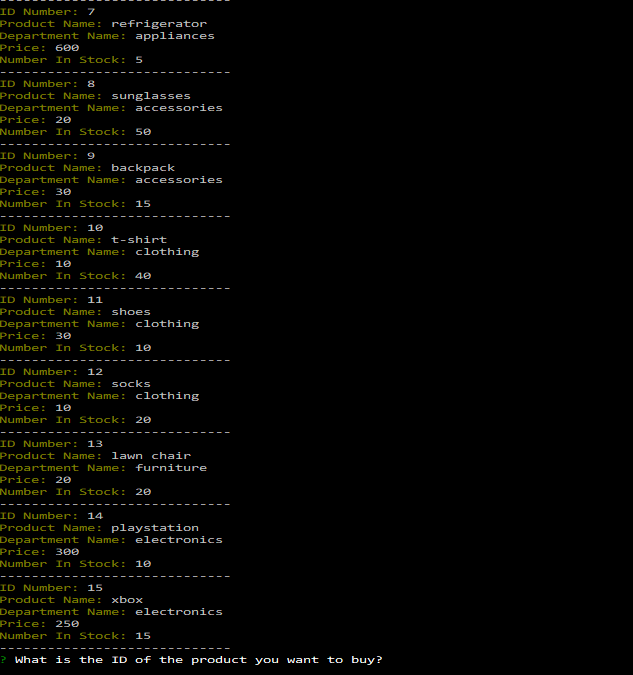
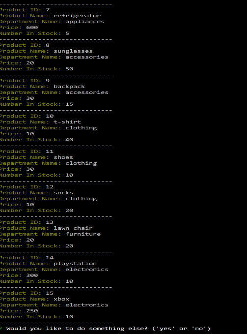
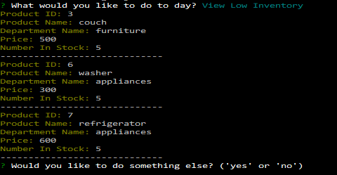
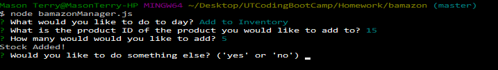
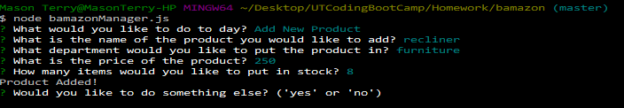
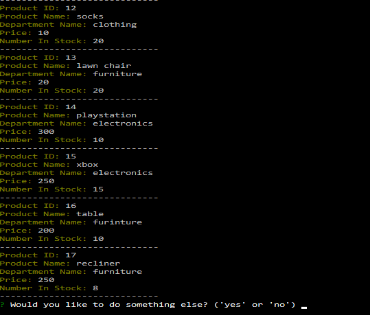

# Bamazon

## Bamazon Customer

### Bamazon is a node app that lets the customer buy from a list of products. The list is stored in a MySQL database.

### The user is prompted a question to see if they want to buy something.

### If they type 'yes', they are provided with a list of products.

### They type in the ID number of the item they want to buy. They are then asked how many they want to buy.

### Once they make the purchase, they are prompted if they want to buy something else. If they type in 'no', they are disconnected.

### Now stock is 5 less for the item with the ID of 15 (xbox).

## Bamazon Manager

### Bamazon Manager allows the manager to check and see what products are for sale, what is low on inventory, add to the stock of products, and add new products.

### The manager is prompted with a list of what they would like to do.

### If the manager selects 'View Products For Sale' a list will be displayed of all the products.

### If the manager selects 'View Low Inventory' a list of all products with an inventory of less than 10 will be displayed.

### If the manager selects 'Add to Inventory' the are prompted with a question asking what product ID they want to add to and then how much they want to add of that product.

### If the manager selects 'Add New Product' they are prompted with a question asking the name of the product they want to add. Then with a question asking what department the product will be in. Then with a question asking the price of the item. Then with a question asking the number that will be in the stock.

